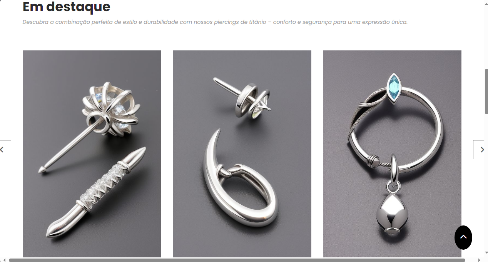
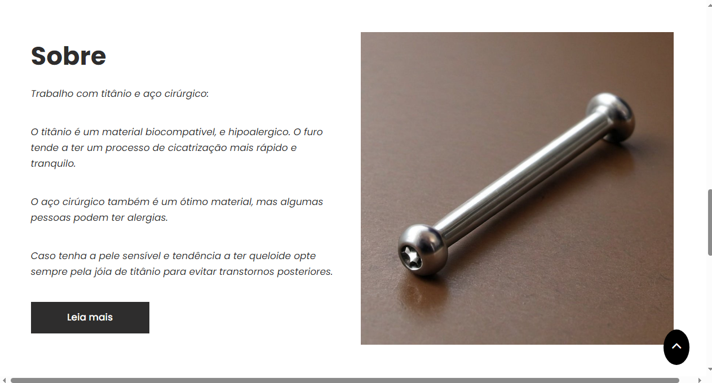
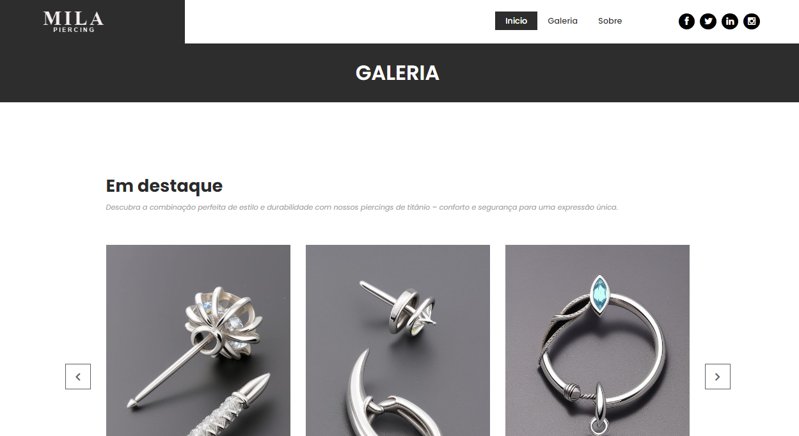
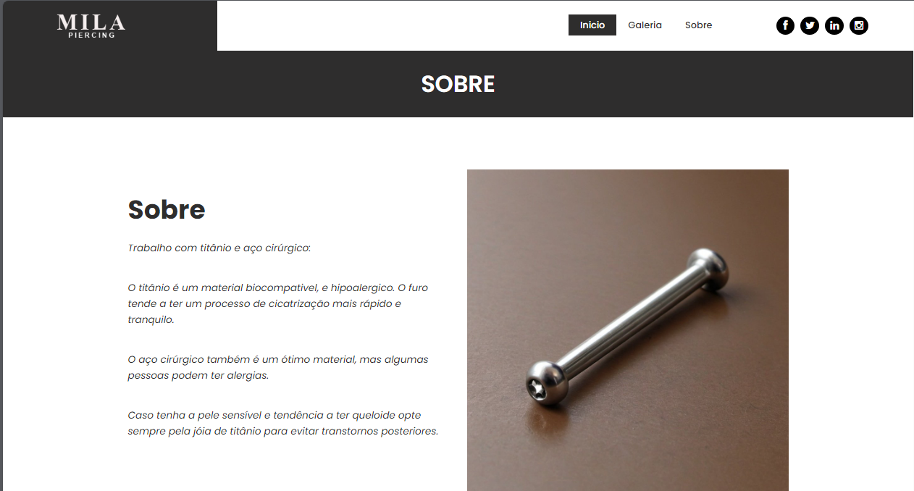
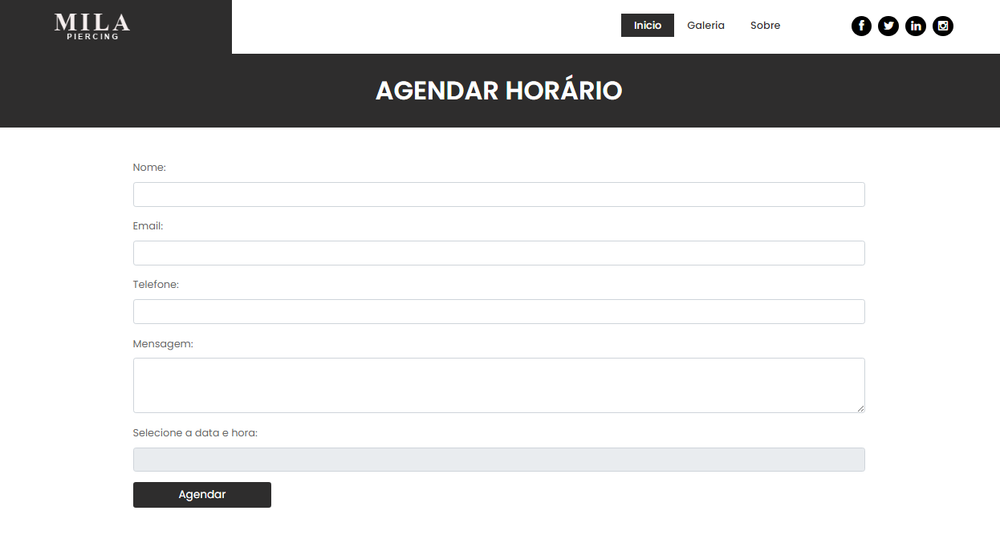

# Piercing Catalog - Site modelo para exposição de piercings!

 

## Ferramentas utilizadas:

|    TIPO    | VERSÃO | VERSÃO |
|:----------:|:------:|:------:|
| Linguagem  |  JAVA  |   17   |
| Estrutural | MAVEN  |   3    |

 

## Dependencias:

|    NOME    | VERSÃO |
|:----------:|:------:|
| Spring Web | 3.3.1  |
| Thymeleaf  | 3.3.1  |
|  DevTools  | 3.3.1  |

 

# Overview:

 

## Pagina inicial com estilo single page:

 
 

## Galeria:

 
 

## Sobre:

## Agendamento:

