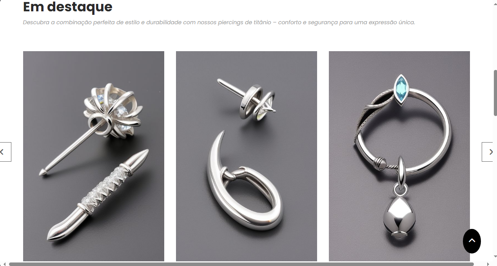
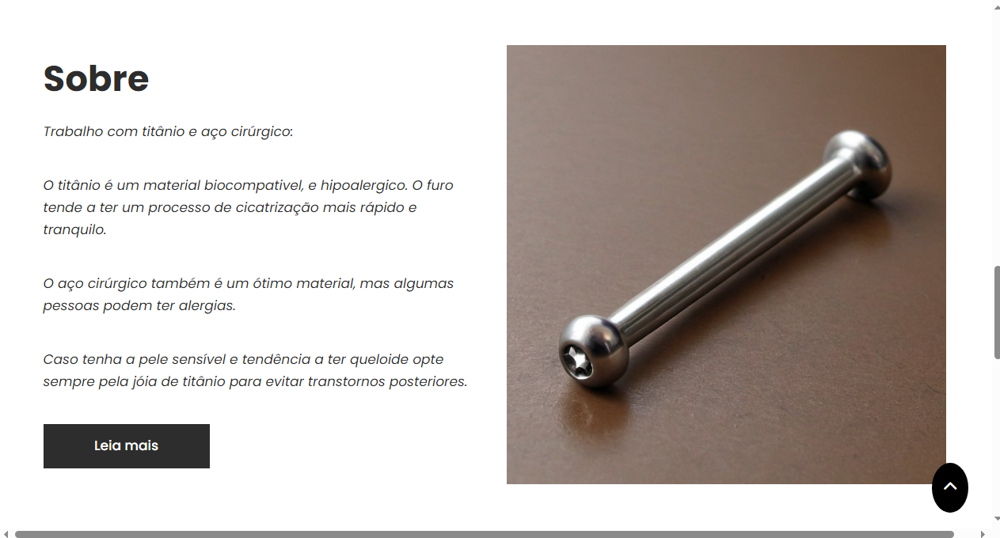
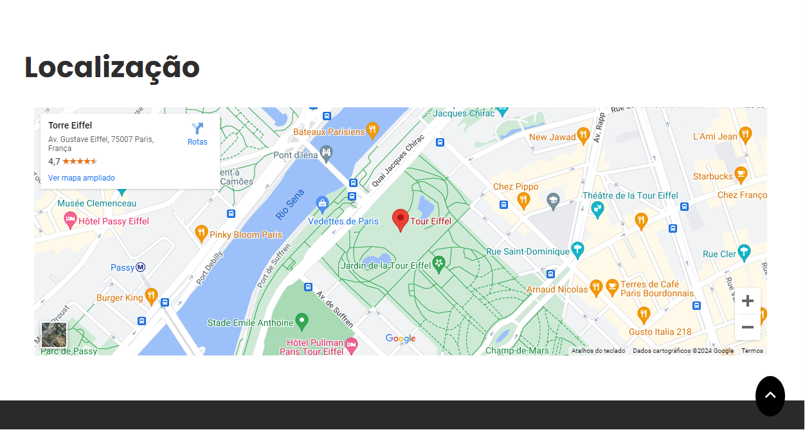
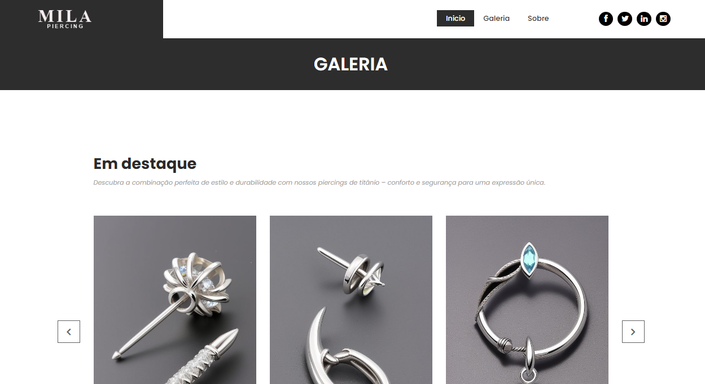
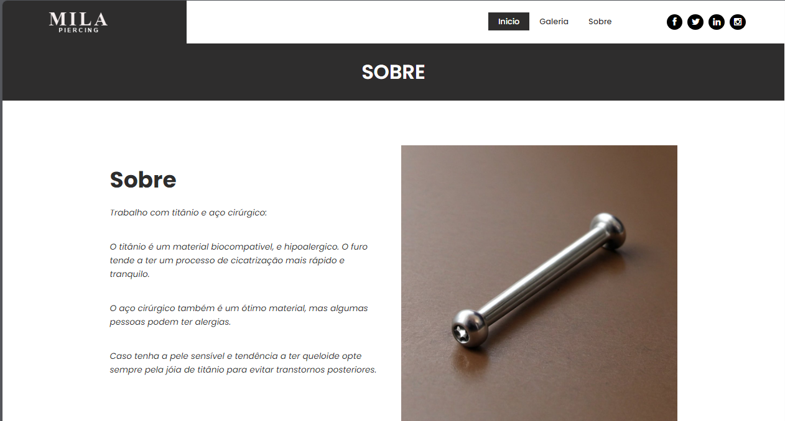
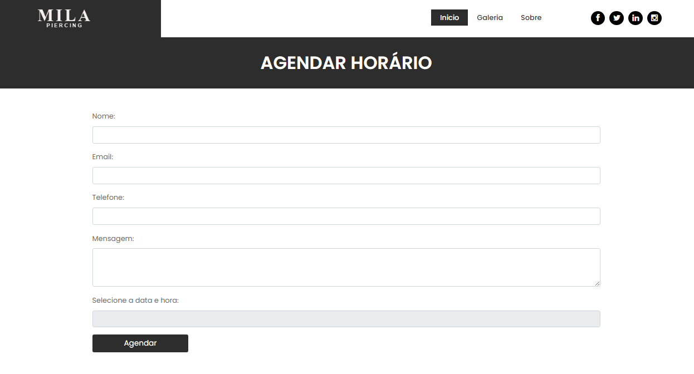

# 💎 Piercing Catalog Website

A modern **Java + Spring Boot + Thymeleaf** web application designed to showcase piercing art and exhibitions.  
This project serves as a **model website** for piercing studios, expos, or artists who want an elegant online presence to display their work, provide information, and allow client contact or scheduling.

---

## 🧠 Project Purpose

The main goal of this project is to demonstrate:
- Server-side rendering with **Thymeleaf**
- Clean backend structure using **Spring Boot**
- A visually appealing, responsive website for artistic exposition
- A real-world use case suitable for small businesses or events

This project can be easily adapted for:
- Piercing studios
- Tattoo studios
- Art exhibitions
- Portfolio or catalog-style websites

---

## 🛠️ Technologies Used

### Core Stack

| Type           | Technology | Version |
|---------------|------------|---------|
| Language       | Java       | 17      |
| Build Tool     | Maven     | 3.x     |
| Framework      | Spring Boot | 3.3.1 |

---

## 📦 Dependencies

| Dependency     | Version |
|---------------|---------|
| Spring Web     | 3.3.1   |
| Thymeleaf     | 3.3.1   |
| Spring DevTools| 3.3.1   |

---

## 🏗️ Architecture Overview

- **Spring MVC** for request handling
- **Thymeleaf** for server-side HTML rendering
- **Static resources** (CSS, images, JS) served via Spring Boot
- Simple and clean structure, ideal for small to medium-sized web applications

---

## 🌐 Application Features

### 🏠 Home Page (Single Page Style)

- Modern, single-page layout
- Smooth navigation between sections
- Designed to highlight visual content and branding






---

### 🖼️ Gallery

- Dedicated gallery section to showcase piercing designs
- Focus on visual presentation
- Easy to expand with dynamic data or database integration in the future



---

### ℹ️ About Section

- Space to present studio information, artist background, or event details
- Ideal for building trust and identity



---

### 📅 Scheduling / Contact

- Section designed for appointments or contact requests
- Can be extended to integrate:
  - Email services
  - WhatsApp links
  - Database persistence
  - External scheduling tools



---

## ▶️ How to Run the Project

```bash
./mvnw spring-boot:run
```
